# 今年行ったところまとめ

## 口上

この記事は[「どもがよ Advent Calendar 2024」](https://adventar.org/calendars/10787)12月2日分です。 

今年は結構色んな場所に行ったなあ～ということで、訪問先まとめです。

### レーダーチャート凡例

- 観光： 一般的な観光資源の魅力
- 食事： そのまま
- 生活： 滞在期間が長くなった時の生活しやすさ。治安や清潔なども含む
- 渡航： 渡航の容易さ。費用と時間の総合評価

## 1月 台北

台北ゲームショウ（TGS)への出展のため渡航。日本の近くにあるAlt Japanその2（その1は韓国）、ご飯も関西人には東京より親しみが持てたりする。今年はどもがよ勢で行った人も多いのであまり説明がいらなくなったかも。

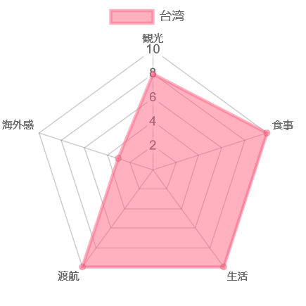
## 2～3月 南欧

### カンヌ・ニース（コートダジュール）

フランス最大、欧州でもSPIEL Essenに次ぐ規模のアナログゲームイベントFestival International de Jeux(FIJ)への参加のため渡航。普通に地中海の碧い海をしていて「ずるいぞ！」という感想に。生牡蠣含む生魚介に地場のロゼワインがあるなどご飯最高でした。立地が陸の孤島で移動手段がほぼ飛行機一択（パリやマルセイユからでも陸路は実質ない）なため、やや行きづらいのが難点。

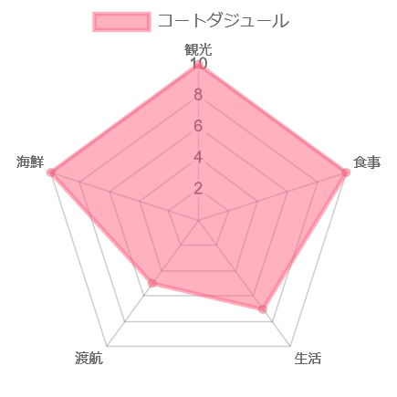

### フィレンツェ

FIJの寄り道で訪問。イタリアと言っても北部なので清潔安全、各種観光資源に関しては説明不要ですね。湿度が高くて山がちなので意外と日本の地方都市感もあり、フィレンツェ空港に降りたら帰国気分になりました。

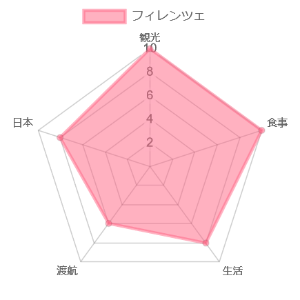
### ローマ

FIJ寄り道その2。「元」世界首都は駅前の道路がボコボコで水たまりが膝下まで浸かりかねない穴が空いている、とにかく汚くてゴミだらけ、そこらじゅうに浮浪者がいて古代ローマ時代の遺跡周辺は荒れ放題、バチカンだけがピッカピカで街全体がカトリックの権威を示す舞台装置化していました。イスタンブール訪問時に覚悟していたバッドイベントをおおむね食らったのがローマで、中進国に行くつもりなら期待値的に合う感じです。ちなみに欧州の南の玄関口なので、行くだけなら意外と安く行けたりする。
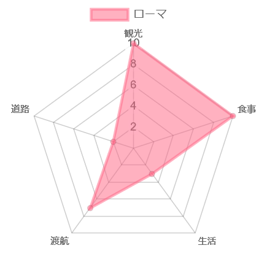
## 4月 香港

シャティン競馬場の取材をするためだけに急遽訪問。中華南方という点で台湾の延長な面はあり、ただし物価は台北より高め。雨は強烈で東京の熱帯化などと言ってもまだまだ大したことないんだなと分からされました。細かい良し悪し以前の話としてCCP統治下という巨大な問題はあり、職種によっては訪問リスクが激烈に高いのは難点。あと金盾こそないものの、ChatGPTはじめ各種AIサービスはアクセスブロックされてたりする。街中に監視カメラはある一方で反体制的な書物を置いている独立系書店もあり、拘束リスクの低い人は結構楽しめるとは思います。

シャティン取材も含めた「世界の競馬場」販売中です、買って（宣伝）　[https://www.melonbooks.co.jp/detail/detail.php?product_id=2491624](https://www.melonbooks.co.jp/detail/detail.php?product_id=2491624)

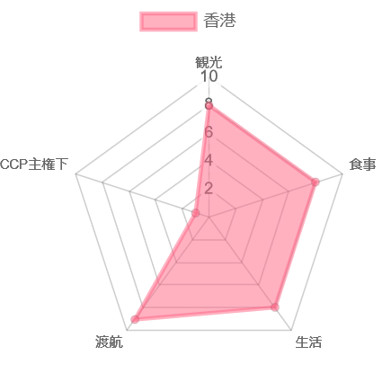
## 8月 インディアナポリス

Gen Conに参加するために訪問。直行便も無くまず行くのが大変、観光資源もほとんどなし（オフシーズンのサーキットと元枢軸国民が行くと微妙な空気になりそうな戦争記念博物館くらい）、郊外に泊まると隣の建物に行くのにUber必須、治安はもちろんUSA水準と合衆国的な難易度のある街です。それを補って天元突破するほどGen Con会場で4日間入り浸れるのは最高なのですが…なお何かと悪口を言われることの多い米国飯ですが、少なくともインディ飯は決して悪くありません。素材の暴力もあるし、バーガーなんかは本格的な米国式で出てきます。華はなくても質と圧でいい飯が出てくるのはドイツっぽいかも。
Gen Con自体に関しては新刊が出たので買って（宣伝）
[https://booth.pm/ja/items/6283498](https://booth.pm/ja/items/6283498)

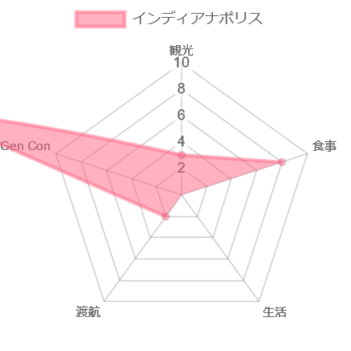

## 9月 台北

Taiwan Original Boardgame Expo(TOBE)に出展するため訪問。出国直前の東京が異様に暑かったのでそこまで暑くは感じなかったものの、雨の多さはちょっと辟易したかも。

## 10月 欧州

### アムステルダム

SPIEL Essen旅程の欧州上陸地点として今年はアムステルダムに。今年はタッチしただけでしたが去年は滞在したのでその時の評価から。アムステルダム・スキポール空港は欧州有数のハブ空港なのでアクセスは良い方。街全体に水路が張り巡らされており、美術館など訪問スポットも多く観光には最高です。ご飯に関しては中華街で食べた飯が一番良かったのでそういうことです。

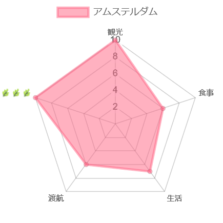
### ケルン

SPIEL Essenへの旅程で行きがけに寄り道する先、3年連続で行くことに。3回目でも大聖堂は全然飽きなくて良かった。

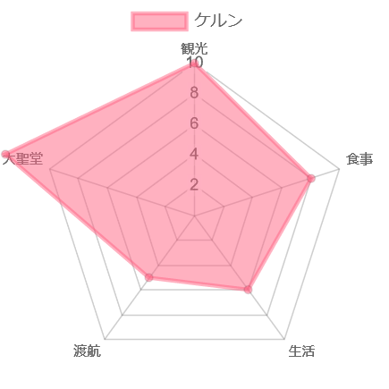
### エッセン

SPIEL Essenに参加するために滞在。マイナーな割に観光資源は意外とあり、街の中心部はプレクリスマスシーズンの夜店で賑っているし、１９世紀の産業遺産（世界遺産）も市内にあります。レストランのドイツ飯も美味しいです。

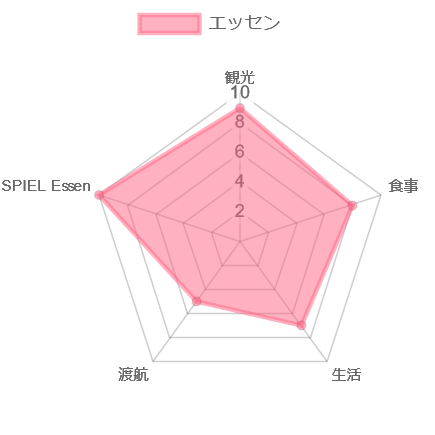

### ベルリン

SPIEL Essenの帰り道で寄り道、主目的地であるプラハへの道中にあったので訪問。流石に帝国時代からの首都だけあって見るものは多いものの、こう、デカい地方都市なんだなと感じるところが端々にありました。感覚だけでなく数字で見ても地方都市でしかなかったりします。戦後のドイツはデュッセルドルフ周辺が集中の極になっていて、統一ドイツ首都の座が戻ってきても中枢にはなれなかったんだなと。加えてお察しの理由により、欧州都市の魅力な旧市街というものがベルリンには存在しません。ソ連が「ドイツ帝国の首都ベルリン」は永遠に破壊したという事実を感じて絶頂する向きにはおすすめです。

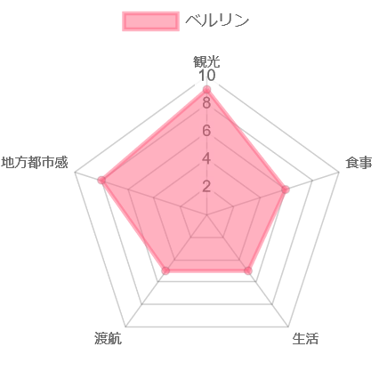
### プラハ

SPIEL Essenの帰り道で寄り道。ドイツやフランスにいると物価の高さで死にそうになる、東欧はまだ安くて過ごしやすいよという情報に釣られて来たんですが、これが思いのほか見どころ大量で一日では全然周りきれませんでした。正直再訪してリベンジしたい。通貨がユーロではなくチェコ・クローナなのもあってか実際心が安らぐ物価でありつつ、実物レベルでの経済水準は高く噂に違わず過ごしやすい街でした。大観光都市なだけあって英語の通用度が高いのも助かりました。日本から行きやすい都市とは言えませんが、個人的にはイチオシです。

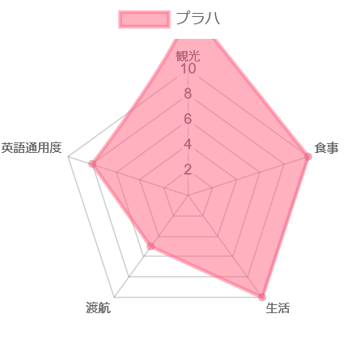
### イスタンブール

SPIEL Essenで欧州からの帰りでストップオーバー的に滞在。物価が安いのでイスタンブール～東京間で飛行機代が安い曜日を待ちつつ過ごすのに使っています。観光資源の多さは説明不要ですね。ご飯の方も「世界三大料/理」なので略。大ロシアがアレした結果として今やイスタンブールは交通の結節点になっており、欧州など遠くに行くときはちょっと旅程をこねれば意外と渡航しやすい場所だったりします。割と欧州化されていて大人しいとは言え、まあユーラシアだよねという部分はあるのでユーラシア免疫の予防接種にもいいかも？なお半自由国でインターネットの完全な自由はないので、TwitterやDiscordが突然遮断されたりするのは注意点。今年は渡航2日前にDiscordが突然遮断されて、入国してから繋がらないな～おかしいな～となってからニュースを見て頭を抱えました。まあ中国みたいにきっちりやらない国なので、幸い迂回経路でDiscordは使えましたが…

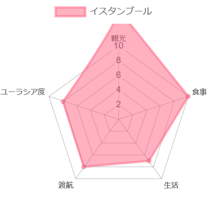
## 11月 鹿児島

「「南国で…（台湾かな）」「飯が美味くて…（台湾かな）」「本土じゃ味わえないタイプの飯が出きて…（台湾っぽい）」「地元の人の言葉が分からないけど、日本語も通じて…（台湾じゃん）」「日式ポップカルチャーがない（……薩摩だ！！！）」

佐賀競馬場を訪問するついでで行ってきました。ご飯最高で九州うまかもんの原液を吸えます。店に入っても酒は安く、薄めてない焼酎グラス一杯は0.7合くらいで出てくるし、水割りで頼んでも酒7:水３くらいで出てきます。当然飯は進むしドシドシ食べなさいという感じで量が出てくる、そして美味い。都市としても南九州の首都の風格があり、本屋も下手に都内の書店行くより品揃えの筋が良さそうでした。オタショップはびっくりするほど無かったので、そういう文化なんだろうなとは思います。本稿唯一の国内都市ですが、他と並べて個人的には違和感がなく体験の質としては割と台湾寄りでした。

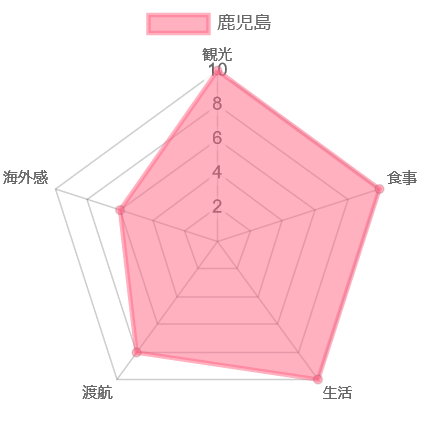
## 11月 シンガポール

Asian Board Game Fesitval(ABGF)に参加するために訪問。アジア太平洋地域なら近い！というつもりで渡航しましたが思ったよりは遠かった。ご飯はホーカーという屋台街の進化系のようなフードセンターがあり、なんと東京で食べるより安くて美味い飯が出てきます（シンガポールの一人当たりGDPは日本の倍くらいあるんですが）。普通に便利な大都市で日系資本の進出も多く、物価もそこまで高くないので生活に困らないです。同じ中華圏の都市国家として香港と比較すると、正直シンガポールの方が圧倒的に未来は明るいなとはなります。一方で全土が湾岸タワマンのような状態なので、観光的な味は個人的には今ひとつ…ちなみに中華人民共和国もドン引きの超監視社会で公共の場では視界内に監視カメラを入れないのが難しく、その上で徹底的な罰則と取り締まりをしているおかげで街はとんでもなくきれいで安全です。快適に過ごせはします。

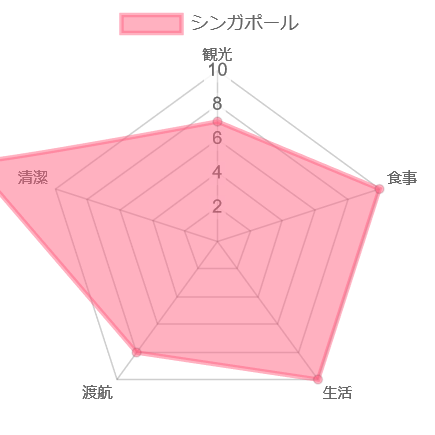
### ジョホールバル

シンガポール観光のやる気があまりに起きなかったので、陸路国境を通る体験をしてみたい！という理由だけで日帰り往復。マレー領の滞在時間は2時間でした。JB（ジョホールバルの愛称）に入るなりシンガポールに存在しなかったハエがありドブ川からは臭いが立ち込め、道はボコボコでイオンに客を吸われて滅びかけているマーケットと国境を超えてアジアに来た！という実感を持てました。皮肉ではなくシンガポールだとどこか弛緩していた精神が活性化したので行って良かったです。あまりゆっくりできなかったものの、その辺の露天で買ったういろう入米菓や辛味カレーココナッツ入チマキなど想像を超えた飯が飛んできて非常に良かったので、次はちゃんとマレーも訪問しようとなりました。

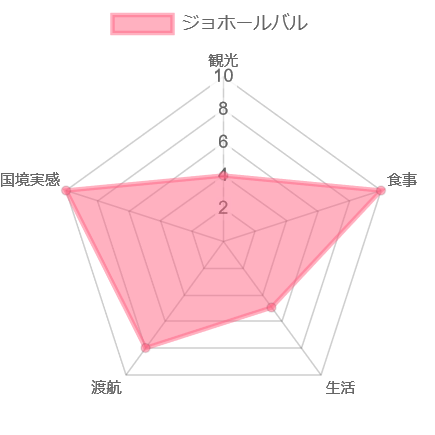

## むすび

数えてみたら今年は８回も海外行っていて、そら常に慌ただしかったわなと…行けるだけ行くをやるとどうなるかは分かったので、来年以降は行き先を見定めて行きたい。１２月はどこにも行かない予定なので今年の渡航は打ち止めなので、年内はゆっくりします。

明日はあおいたくさんが何かを書いてくれるはずです。

レーダーチャート作成： https://chachart.net/radar
